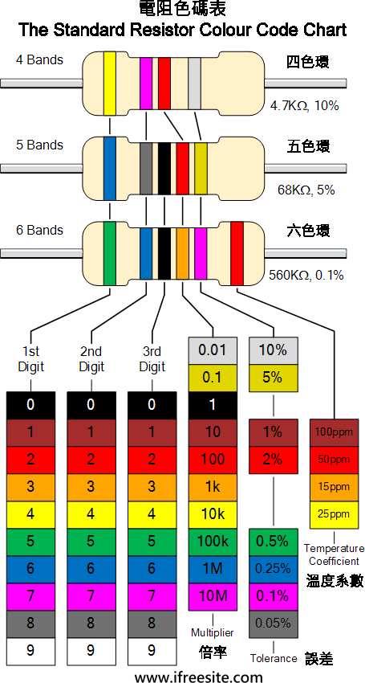
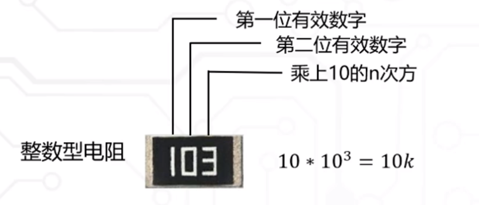
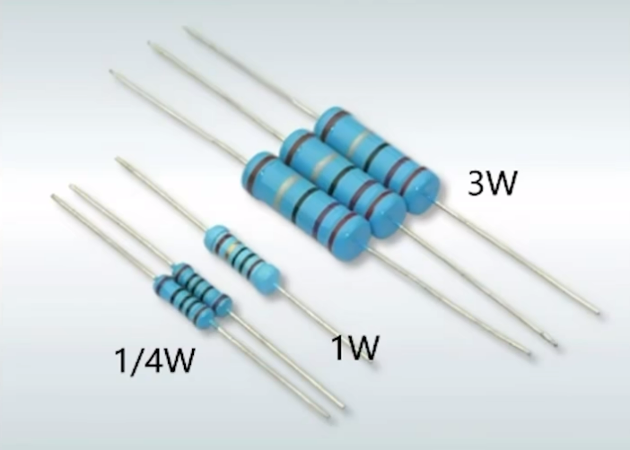
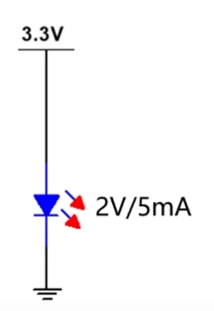
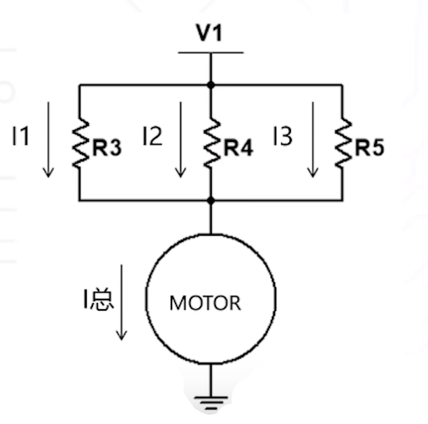
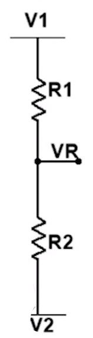

# HDLearing
硬件设计学习

> 参考：[凡亿教育-硬件工程师完全零基础入门教程]()

## 一. 电路设计安全要点

1. 入门小白不要直接接触市电（220V~），建议购买一个直流稳压电源
2. 人体安全电压：交流电压 36V，交流电流 10mA；直流电压 50V 左右，直流电流 50mA 左右
3. 电压不可怕，可怕的是电流流过身体（心脏）
4. 即便要用手试电，也建议用右手手背触碰（用右手是因为心脏偏左）

## 二. 电阻

### 1. 欧姆定律

$$
I=\frac{U}{R} \ \ \ \ \ \ \ \ \ R=\frac{U}{I} \ \ \ \ \ \ \ \   U=I*R
$$

- $I$ : 电流
- $U$ : 电压
- $R$ : 电阻

### 2. 电阻的阻值识别

#### 2.1 色环电阻

#### 2.2 贴片电阻

>  实际购买的电阻存在偏差，不同种类的电阻精度不同，精度越高价格越贵。

### 3. 电阻的功率

电阻功率计算公式：
$$
P=I*U \ \ \ \ \ P=I^2*R \ \ \ \ \ P=\frac{U^2}{R}
$$

>  设计电路过程中，一定不能够超过电阻的功率，否则电阻发热会很严重。

### 4. 电阻的限流作用

当供电电压大于负载的工作电压时，可以利用电阻限流。

**注意：** 电路中不能超过电阻的功率，同时尽可能只工作在供电电压与负载工作电压相差不大或者工作电流很小的场景。

> 直插 LED 元器件，长脚为正，短脚为负。

### 5. 电阻的分流功能

电阻分流公式：
$$
I_总=I_1+I_2+I_3
$$

可以通过使用多个小功率的电阻**并联分流**，给一个大功率器件进行限流。

**注意：** 电阻并联之后的总电阻必须与限流电阻值匹配。

### 6. 电阻的分压功能

电阻分压公式：
$$
V_R=\frac{(V_1-V_2) * R_2}{R_1+R_2}+V_2
$$

也可以通过使用多个小功率的电阻**串联分压**，给一个大功率器件进行限流。

也可以利用电阻分压功能做参考电压。

## 三. 电容

电容简单来说就是两块不连通的导体加上中间的绝缘材料构成的。

> 电解电容分正负，一般灰色丝印条所对的为正极，对于直插电解电容长脚为正，短脚为负。
>
> 电解电容当反接或超出额定电压后会炸，使用时一定需要正确连接，确保电压不超出额定范围，注意安全。

### 1. 常见电容种类及特性

- CBB 电容：部分
